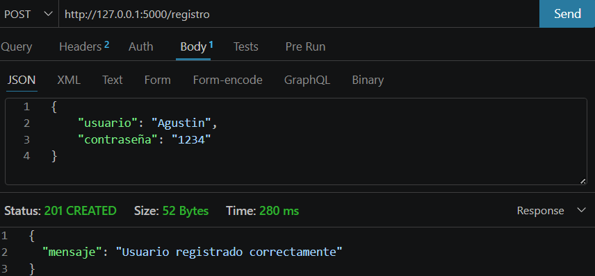
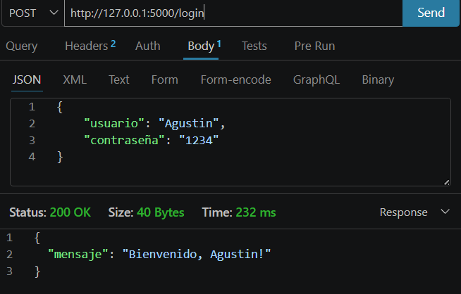
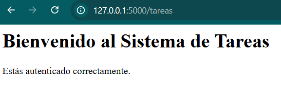
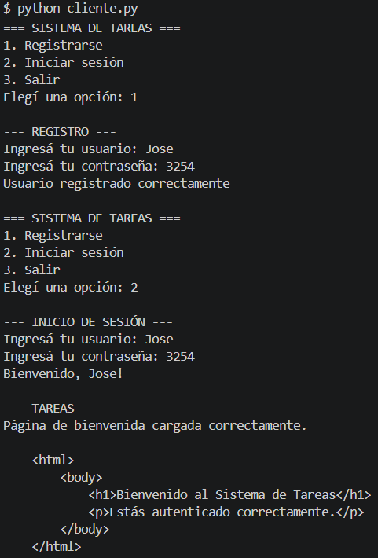

# PFO 2: Sistema de Gestión de Tareas con API y Base de Datos

## Descripción
Sistema de gestión de tareas con autenticación de usuarios, desarrollado con Flask y SQLite.

## Requisitos
- Python 3.x
- Flask
- bcrypt
- requests

## Instalación
1. Cloná el repositorio o descargá los archivos.
2. Abrí una terminal en la carpeta del proyecto.
3. Instalá las dependencias:
```bash
python -m pip install flask bcrypt requests
```

## Cómo ejecutar

### 1. Iniciar el servidor
```bash
python servidor.py
```
El servidor quedará corriendo en `http://127.0.0.1:5000`

### 2. Iniciar el cliente
Abrí una terminal nueva y ejecutá:
```bash
python cliente.py
```

## Endpoints disponibles

| Método | Endpoint | Descripción |
|--------|----------|-------------|
| POST | /registro | Registra un nuevo usuario |
| POST | /login | Inicia sesión |
| GET | /tareas | Muestra página de bienvenida |

## Pruebas con Thunder Client

### Registro
- **Método:** POST
- **URL:** `http://127.0.0.1:5000/registro`
- **Body:**
```json
{
    "usuario": "juan",
    "contraseña": "1234"
}
```

### Login
- **Método:** POST
- **URL:** `http://127.0.0.1:5000/login`
- **Body:**
```json
{
    "usuario": "juan",
    "contraseña": "1234"
}
```

### Tareas
- **Método:** GET
- **URL:** `http://127.0.0.1:5000/tareas`

## Tecnologías utilizadas
- **Flask** — framework para la API REST
- **SQLite** — base de datos local
- **bcrypt** — hasheo de contraseñas
- **requests** — cliente HTTP en consola

## Capturas de pantalla de las pruebas realizadas

### Registro


### Login


### Tareas


### Cliente
